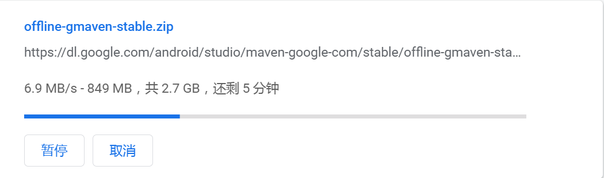

# ⏰ 自动获取订阅链接

- 用 Python 实现自动合并 ss ssr trojan vmess vless 等免费节点链接。
- Fork后，可以设置自己的SecretKey。
- 在项目Setting ---> Secrets and variables --->Actions，点新新建 New repository secret，再输入Name值为GT_TOKEN，Secret值为你自己生成的Personal access tokens (classic)
- 在右上角用户中心，Settings ---> Developer Settings ---> Tokens（classic），再点Generate new toen，按要求设置好后生成Personal access tokens。

## 💌 Clash更新推送 适用于Clash 订阅，适用于 Clash .NET 等。openclash.yaml支持udp：true参数。
```
http://122.225.207.101:8080/ipfs/QmdRhmLxx6JaFE3iG7wxi47bDhva6xqKQEoJuUwpKHfgLS?filename=clash.yaml
```

## 👩‍👩‍👧‍👦 Telegram电报群(发送订阅链接获取最新Clash链接)

- https://t.me/opmhth
- 沟通请加Telegram群

## 🚀 Speed测试



## ⚠️ 注意

- 欢迎免费使用本订阅,链接来自网络，仅作学习使用。使用页面所提供的任意资源时，请务必遵守当地法律。

## ⭐ 特别感谢

- https://github.com/codingbox/Free-Node-Merge
- https://github.com/animalize/qqwry-python3